# 2do Parcial Aspectos Legales

---

# Evaluaciones

- [Banco de Datos](#bancos-de-datos)
- [Licenciamiento de uso](#licenciamiento-de-uso)
- [Derechos de Internet](#derechos-de-internet)
- [Delitos Informáticos](#delitos-informáticos)
- [Parcial Ideas](#parcial-ideas)
- [Segundo Parcial Aspectos Legales - Ingeniería 2025](#segundo-parcial-aspectos-legales---ingeniería-2025)

## Bancos de Datos

**1) ¿Cuál de los siguientes datos NO se encuentra dentro del ámbito de aplicación de la ley de Bancos de Datos?**

- [ ] Los datos médicos  
- [ ] Los datos de identidad mínimos de una persona  
- [ ] Los datos estadísticos  

Respuesta

✅ **Los datos estadísticos**

Según lo establecido en la Ley 25.326:

> Los **datos disociados**, como los **estadísticos**, **no permiten identificar al titular**, ya que fueron tratados para hacer imposible su vinculación con una persona determinada. Por ello, **no se consideran datos personales** y **están excluidos del ámbito de aplicación** de la ley.

En cambio:

* Los **datos médicos** son **datos sensibles** y están expresamente regulados por la ley.
* Los **datos de identidad mínimos** (nombre, domicilio, DNI, etc.) son **datos personales de acceso público**, también incluidos en la ley.

---

**2) La obligación de recabar los datos personales previa autorización de su titular, está vinculada a qué principio**

- [ ] La licitud y buena fe  
- [ ] La Confidencialidad  
- [ ] La calidad de los datos  

Respuesta

✅ **La licitud y buena fe**

De acuerdo con la Ley 25.326 y el **art. 4.2** establece el:

> **"principio de licitud y lealtad en el tratamiento de datos personales"**, indicando que la recolección **no puede hacerse por medios desleales o sin consentimiento expreso e informado** del titular.

Este principio exige que **el tratamiento de los datos sea legal y transparente**, y que **el consentimiento informado** sea **condición necesaria para la recolección** de datos personales.

Las otras opciones:

* **Confidencialidad** → se refiere a la obligación de **guardar secreto** sobre los datos recolectados (art. 10).
* **Calidad de los datos** → se refiere a que los datos deben ser **veraces, actualizados y pertinentes** (art. 4.4).

---

**3) ¿Cuál es el sistema de la ley de bancos de datos respecto a la responsabilidad administrativa?**

- [ ] No dice nada  
- [ ] Establece cuáles son las sanciones y delega en la autoridad de aplicación definir cuáles son las conductas prohibidas  
- [ ] Establece las conductas prohibidas y sus respectivas sanciones  

Respuesta

❌ ESTA NO **Establece las conductas prohibidas y sus respectivas sanciones**

La Ley 25.326 **no se limita solo a sancionar**, sino que **define claramente las conductas prohibidas** (como la recolección de datos sensibles sin consentimiento, uso indebido, falta de inscripción del banco, cesión sin autorización, etc.) y **establece el régimen sancionatorio correspondiente**.

Además:

* El artículo 32 **modifica el Código Penal**, incorporando el **art. 157 bis**, que **penaliza la revelación indebida de datos** cuando hay obligación de confidencialidad.
* También se detallan **infracciones administrativas** y sus sanciones (multas, clausura, etc.) a través de la **autoridad de aplicación**.

Por lo tanto, **no se delega totalmente** en la autoridad, sino que la ley ya establece un marco normativo claro.

En la autoevaluación estaba mal

✅ **Establece cuáles son las sanciones y delega en la autoridad de aplicación definir cuáles son las conductas prohibidas**

Esto significa que, **aunque la ley establece el régimen sancionatorio**, **las conductas prohibidas no están todas específicamente detalladas en el texto de la ley**, sino que se **delegan parcialmente en la autoridad de aplicación** (la Agencia de Acceso a la Información Pública en Argentina) para su reglamentación o interpretación.

Mi error fue asumir que todas las conductas prohibidas estaban claramente definidas en la ley, cuando en realidad muchas **quedan sujetas a regulación administrativa posterior**.

---

**4) Los datos sensibles**

- [ ] Están fuera del ámbito de aplicación de la ley  
- [ ] Pueden ser tratados siempre que exista un consentimiento informado del titular de los datos  
- [ ] Salvo excepciones no pueden ser recogidos ni tratados  

Respuesta

✅ **Salvo excepciones no pueden ser recogidos ni tratados**

La Ley 25.326 establece en el **artículo 7.2** que:

> "**Queda prohibida la formación de archivos, registros o bancos de datos que almacenen información que revele directa o indirectamente datos sensibles**, salvo en los casos expresamente autorizados por la ley."

**Los datos sensibles** (como salud, vida sexual, origen étnico, religión, opiniones políticas, etc.) solo pueden ser tratados en **casos excepcionales**, como:

* Fines estadísticos y disociados
* Instituciones como iglesias o sindicatos, respecto de sus miembros
* Profesionales de la salud, en el marco de su actividad
* Razones de interés público debidamente justificadas

Por tanto, **su tratamiento está prohibido de forma general** y solo se permite en **supuestos muy específicos**.

---

**5) ¿Cuál de las siguientes hipótesis es una excepción a la obligación de autorización para recabar los datos?**

- [ ] La contratación de un servicio que necesite acceder a estos datos para ser cumplido  
- [ ] La renuncia anticipada del titular de los datos  
- [ ] Que la conducta del titular de los datos permite inferir que autoriza la recolección  

Respuesta

✅ **La contratación de un servicio que necesite acceder a estos datos para ser cumplido**

Según la **Ley 25.326, artículo 5**, existen excepciones a la obligación de contar con consentimiento previo para la recolección de datos. Una de ellas es:

> **“Cuando los datos se recaben en el ejercicio de funciones propias de los poderes del Estado o en virtud de una obligación legal o contractual del titular de los datos.”**

Esto incluye los **casos contractuales**, como cuando alguien **contrata un servicio** y es **necesario acceder a ciertos datos personales** para cumplir con ese contrato (por ejemplo, nombre, dirección para entrega, etc.).

Las otras opciones son incorrectas porque:

* **La renuncia anticipada del titular** no está prevista por la ley y **no suprime sus derechos**.
* **Inferir consentimiento por conducta** está **prohibido**: el consentimiento debe ser **libre, expreso y por escrito**.

---

## Licenciamiento de uso

**1) La licencia de uso propietaria o privativa está definida por**

- [ ] La prohibición del acceso al código fuente  
- [ ] El carácter oneroso  
- [ ] La existencia de derechos de autor sobre el programa  

Respuesta

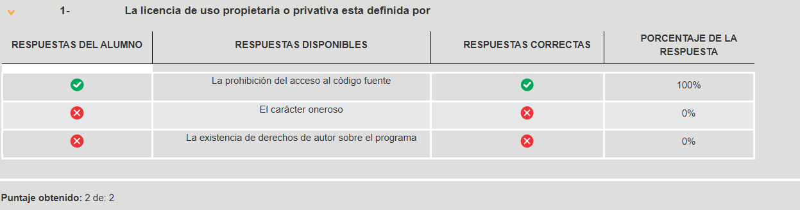

**✅ La prohibición del acceso al código fuente**

La característica distintiva de la **licencia de uso propietaria o privativa** no es su precio ni el hecho de que existan derechos de autor (que también existen en el software libre), sino la **prohibición del acceso y modificación del código fuente**.

Esto está claramente explicado en el texto:

> “Tradicionalmente, las mismas otorgan al usuario la posibilidad de utilizar el programa tal cual fue entregado, **prohibiendo la modificación del mismo**. Tales licencias se conocen como **propietarias**.”

Y más adelante se vincula con el acceso al código fuente:

> “De lo expuesto surge claramente que, **para modificar el programa original, el usuario necesita el archivo de código fuente**, toda vez que el código objeto no permite su alteración por el usuario.”

Por lo tanto, el rasgo definitorio es **la restricción de acceso al código fuente**, no su gratuidad o pago, ni la existencia de derechos de autor (que existen en todos los modelos).

---

**2) ¿Cuál es la relación entre la open source y el free software?**

- [ ] Son sinónimos  
- [ ] La open source es una subdivisión del movimiento GNU  
- [ ] Son dos movimientos diferentes  

Respuesta

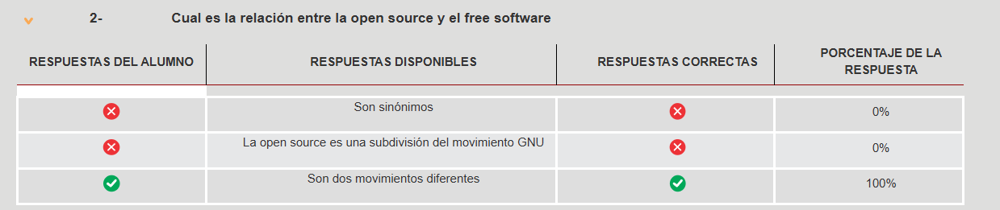

**✅ Son dos movimientos diferentes**

Aunque muchas veces se usan como sinónimos, el texto deja claro que el **software libre (free software)** y el **open source** son **dos movimientos distintos**, con fundamentos técnicos, filosóficos y legales diferentes:

> “Si habitualmente se utiliza la expresión de software libre y código abierto como sinónimos, en verdad, ambos términos denotan **concepciones técnicas, filosóficas y legales**, que si bien son similares, presentan **diferencias notables**.”

Además:

- El movimiento de **software libre** tiene un fuerte componente **ideológico y ético**, centrado en la **libertad del usuario**.
- El **open source**, promovido por la Open Source Initiative, se enfoca más en **criterios técnicos** y eficiencia en el desarrollo colaborativo.

Por eso, **no son sinónimos ni uno depende del otro**: son **dos movimientos diferentes**, aunque en ocasiones puedan compartir herramientas o licencias.

---

**3) El copyleft impide que el usuario modifique**

- [ ] Los términos y condiciones de la licencia  
- [ ] El carácter gratuito de la distribución  
- [ ] El código fuente  

Respuesta

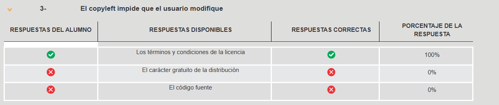

**✅ Los términos y condiciones de la licencia**

El **copyleft** **no impide modificar el código fuente** —de hecho, lo permite y lo promueve— pero **sí impide que se distribuyan versiones modificadas bajo licencias más restrictivas**. Es decir, **obliga a mantener los mismos términos y condiciones de la GPL**.

Del texto:

> “En el caso de la GPL, los derechos otorgados a los licenciatarios del programa original, quedan sujetos a la condición de que los mismos otorguen **similares libertades al momento de la nueva distribución**.”

> “Un programa sujeto a Copyleft no puede modificarse ni distribuirse **a menos que se haga bajo los términos y condiciones de la GPL**…”

Por lo tanto, **el copyleft impide modificar los términos de la licencia**, no el código fuente ni su distribución gratuita.

---

**4) La licencia oficial de la Open Source Foundation es**

- [ ] La Python  
- [ ] La Apache  
- [ ] No tiene una licencia oficial  

Respuesta

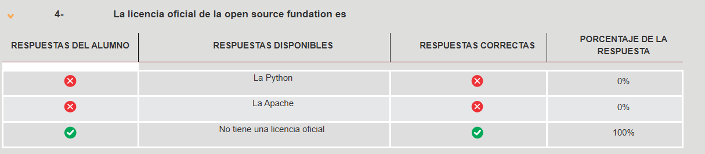

**✅ No tiene una licencia oficial**

La **Open Source Initiative (OSI)** —a veces llamada incorrectamente "Open Source Foundation"— **no promueve una única licencia oficial**, sino que **certifica licencias de terceros** que cumplan con ciertos criterios.

Del texto:

> “A diferencia de los propulsores del software libre, **los miembros de la Open Source Initiative no promueven una licencia única** sino **un programa de certificación de licencias de terceros**, las cuales deben cumplimentar los criterios establecidos por la iniciativa.”

Esto significa que **tanto la licencia Apache como la Python pueden estar certificadas**, pero **ninguna de ellas es “la oficial”**. Por eso, **la opción correcta es "No tiene una licencia oficial"**.

---

**5) LGPL es**

- [ ] Una licencia de open source  
- [ ] Un licencia GNU que se utiliza para librerías  
- [ ] Un versión reducida de la GPL  

Respuesta

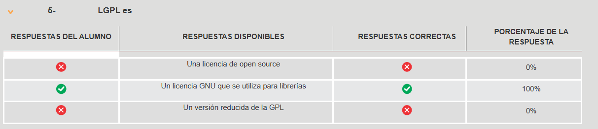

**✅ Una licencia GNU que se utiliza para librerías**

La **LGPL (Lesser General Public License)** es una **licencia de la Free Software Foundation** pensada **específicamente para librerías**, y permite que estas se utilicen en programas que no están licenciados bajo GPL.

Del texto:

> “La licencia **LGPL aporta una solución** al permitir la distribución tanto de la **librería** como del programa principal bajo términos independientes.”

Y también:

> “**La Free Software Foundation promueve otras dos licencias**: La denominada **Lesser General Public License (LGPL)** y la **Affero General Public License (AGPL)**.”

Por lo tanto, **la opción correcta es que es una licencia GNU usada para librerías**. No es simplemente open source ni una versión reducida (aunque tenga menos restricciones que la GPL).

---

## Derechos de Internet

**1) La internet se encuentra manejada en la actualidad por**

- [ ] La sociedad de internet  
- [ ] La Fundación de Ciencias  
- [ ] El Ministerio de defensa de los EE UU  

Respuesta

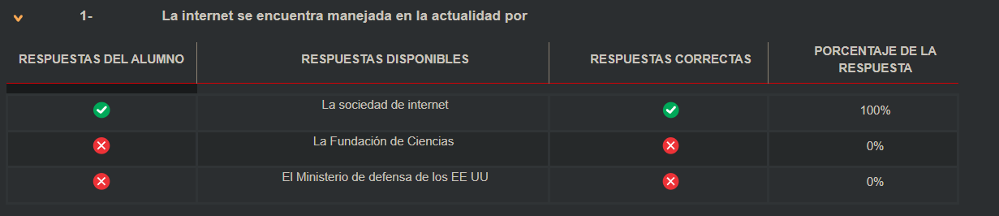

**✅ La sociedad de internet**

Actualmente, **Internet no está dirigida por una sola entidad gubernamental o privada**, pero en sus aspectos técnicos está **coordinada por la Sociedad de Internet (Internet Society)**.

Del texto:

> “Sin embargo, ello no impide la existencia de un organismo de control de la internet, el cual, por lo menos en sus aspectos técnicos ejerce un control sobre ella.

> **La Sociedad de Internet es una organización no gubernamental**, sin nacionalidad definida ni fines de lucro [...] trabajan elaborando políticas y prácticas para ser adoptadas por la red [...]”

Además:

- El **Ministerio de Defensa de EE.UU.** estuvo a cargo del proyecto **ARPAnet**, pero **se retiró en 1990**.
- La **Fundación de Ciencias Naturales** también tuvo el control hasta **1995**, momento en el cual **se lo delega a operadores privados**.

Por lo tanto, **la opción correcta es "La sociedad de internet"**.

---

**2) La relación entre el nombre de dominio y la marca comercial es**

- [ ] La marca comercial absorbe al nombre de dominio  
- [ ] El nombre de dominio absorbe a la marca comercial  
- [ ] Son independientes  

Respuesta

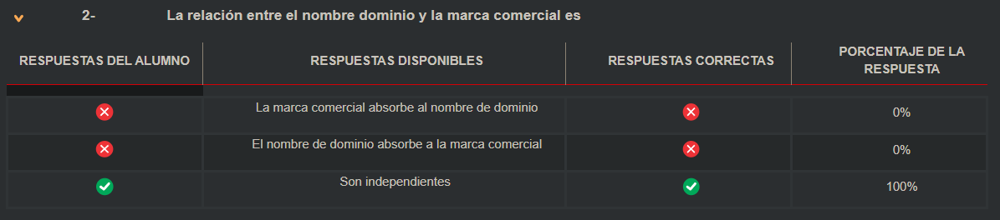

**✅ Son independientes**

Según el texto, **los nombres de dominio y las marcas comerciales no pueden asimilarse jurídicamente**, ya que presentan **características distintas**:

> “Por lo tanto, **no es posible asimilar los nombres de dominio a las marcas comerciales**, lo cual, sin embargo, no impide que entre ambas figuras se produzcan relaciones.”

También se detallan diferencias como:

- Las marcas tienen protección territorial y sectorial, los dominios no.
- Las marcas tienen identidad gráfica/iconográfica, los dominios no.
- Los dominios pueden no tener fines comerciales, las marcas sí implican productos o servicios.

Por lo tanto, la respuesta correcta es que **son independientes**.

---

**3) Los nombres de dominio con genéricos geográficos son manejados por**

- [ ] La autoridad de asignación de números de internet  
- [ ] La autoridad de aplicación del país que refiera dicho dominio  
- [ ] Queda en manos de particulares que concesionan el servicio  

Respuesta

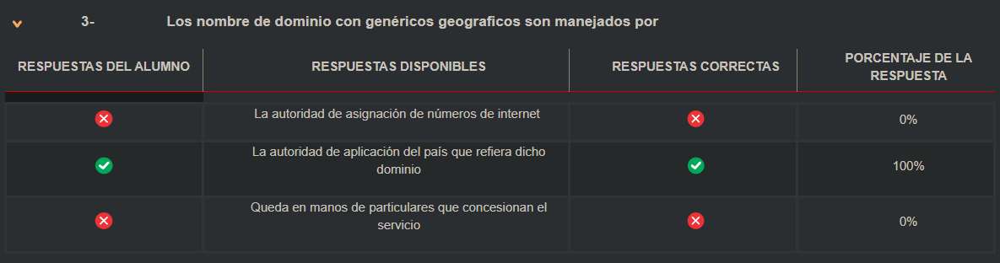

**✅ La autoridad de aplicación del país que refiera dicho dominio**

Según el texto:

> “...la cláusula compromisoria elaborada por la IANA a los efectos de saldar las controversias que pudieran suscitarse respecto a la asignación de los nombres de dominio [...] es aceptada al momento de registrar el nombre de dominio en la autoridad de aplicación ya sea la IANA o la autoridad local, en nuestro caso NIC-Argentina.”

Esto implica que **los dominios con indicativo geográfico como .ar** están a cargo de una autoridad **nacional**, y no de un organismo global como la IANA. En el caso argentino, **NIC Argentina** es la autoridad competente.

---

**4) Según el fallo Belén Rodríguez, la responsabilidad de buscadores y hostings es**

- [ ] Subjetiva  
- [ ] Objetiva  
- [ ] El fallo no lo define  

Respuesta

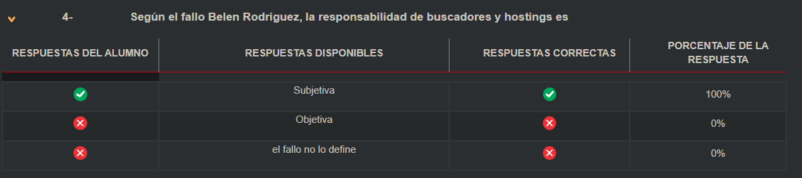

Subjetiva

----

**5) Según lo establecido por el fallo mayoritario, una vez debidamente notificados, los buscadores y hosting deben bloquear el contenido**

- [ ] Solo el contenido denunciado  
- [ ] El contenido que consideren es manifiestamente ilegal  
- [ ] Deben activamente buscar y bloquear el contenido similar al denunciado  

Respuesta

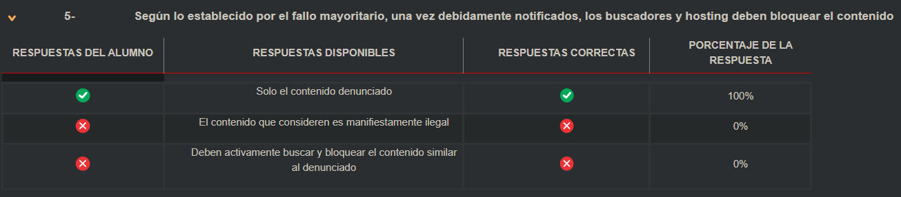

✅ **Solo el contenido denunciado**

En el fallo mayoritario del caso *Belén Rodríguez*, la Corte Suprema estableció que los buscadores no tienen obligación de monitorear proactivamente los contenidos ni de bloquear otros contenidos similares. Solo están obligados a **bloquear el contenido específicamente denunciado**, siempre y cuando hayan sido **debidamente notificados** y se trate de una situación donde **no se requiere intervención judicial previa** (por ejemplo, en casos de contenidos notoriamente ilícitos o claramente ofensivos).

Esto evita imponer un deber de censura preventiva o control generalizado del contenido, alineándose con estándares internacionales como la Directiva Europea 2000/31.

---

## Delitos Informáticos

**1) ¿Cuál es la regulación actual de la tenencia de pornografía infantil en la República Argentina?**

- [ ] Se penaliza la tenencia simple y la tenencia con fines de distribución  
- [ ] Se criminaliza la tenencia con fines de distribución  
- [ ] Se aplica la misma pena que la distribución y producción del material  

Respuesta

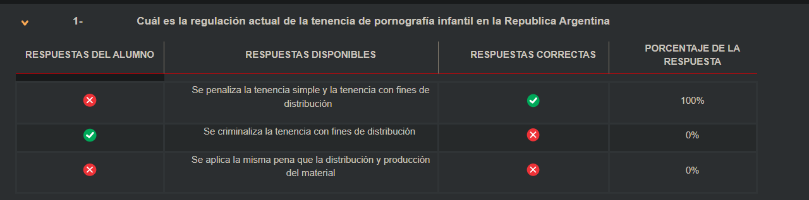

✅ Se penaliza la tenencia simple y la tenencia con fines de distribución

La Ley 26.388, que modificó el Código Penal argentino en 2008, incorporó delitos vinculados a los sistemas informáticos y también penalizó la simple tenencia de pornografía infantil, además de la producción y distribución.

"Será reprimido con prisión de tres meses a un año el que tuviere en su poder representaciones de menores de 18 años dedicados a actividades sexuales explícitas."

Por tanto, la tenencia simple ya es punible, y no solo la destinada a distribución.

---

**2) La destrucción negligente de datos de un sistema está penada como**

- [ ] No está penada. El delito de daño siempre implica dolo  
- [ ] Como una figura atenuada (menos pena) del daño  
- [ ] A los efectos de la figura no importa si se produjo por dolo o culpa  

Respuesta

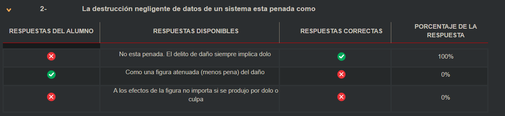

✅ No está penada. El delito de daño siempre implica dolo

Según el Código Penal argentino, el delito de daño a datos, sistemas o archivos exige intención dolosa, es decir, la voluntad consciente de causar el daño. Por tanto, la negligencia (culpa) no es punible en este caso.

“El tipo penal de daño informático exige dolo. La conducta culposa, como la negligencia o impericia, no configura delito.”

---

**3) Una estafa informática implica**

- [ ] Un engaño producido por medios informáticos  
- [ ] La obtención de los datos de una persona mediante técnicas de ingeniería social  
- [ ] La modificación del funcionamiento del sistema  

Respuesta

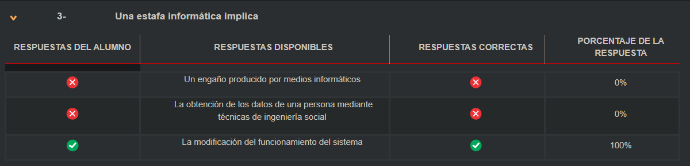

**✅ La modificación del funcionamiento del sistema**

Según el marco legal argentino, la figura de **estafa informática** (incorporada por la Ley 26.388) incluye supuestos donde el autor **modifica el funcionamiento de un sistema informático con el fin de provocar un perjuicio patrimonial**. Es un tipo penal autónomo que no requiere el clásico engaño de la estafa tradicional.

---

**4) Al momento de la sanción de la ley, la aplicación Whatsapp no existía. Si una persona interfiere con dichos mensajes, ¿comete un delito?**

- [ ] Sí, porque el tipo penal refiere a toda comunicación electrónica  
- [ ] Sí, porque por analogía se amplía a los servicios similares pero no previstos en el texto  
- [ ] No, porque no está previsto en la ley  

Respuesta

**✅ Sí, porque el tipo penal refiere a toda comunicación electrónica**

El Código Penal argentino **no limita la protección a servicios específicos**, sino que se refiere a **“comunicaciones electrónicas”** en general. Por lo tanto, **la protección abarca aplicaciones como Whatsapp**, aun cuando no existieran al momento de sancionarse la norma, debido a la **redacción amplia del tipo penal**.

---

**5) El phishing está previsto en el código como**

- [ ] Una forma de estafa  
- [ ] Una forma de hurto  
- [ ] No está previsto en el código  

Respuesta

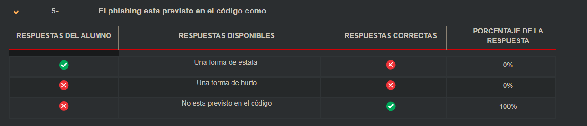

El phishing, como práctica específica, no se encuentra tipificado explícitamente en el Código Penal argentino. Si bien puede ser perseguido bajo otras figuras (como la estafa o el fraude), no existe una norma que mencione expresamente el “phishing”.

“En la legislación argentina, el phishing no cuenta con un artículo específico que lo regule, lo que ha generado reclamos por reformas legislativas que aborden los delitos informáticos de forma más directa.”

---

## Parcial Ideas

> Las respuestas son full chatgpt 😶

**1) Una licencia no propietaria se encuentra definida por**

* [ ] La utilización de la licencia GPL
* [ ] El carácter gratuito del contrato
* [ ] El acceso en el código fuente

Respuesta

✅ **El acceso en el código fuente**

Una licencia **no propietaria** permite el acceso, estudio, modificación y redistribución del código fuente. Esa es la **característica distintiva** frente a las licencias privativas, que lo prohíben.

> “De lo expuesto surge claramente que, **para modificar el programa original, el usuario necesita el archivo de código fuente**, toda vez que el código objeto no permite su alteración por el usuario.”

El carácter gratuito **no es un requisito**, ya que existen licencias libres u open source **que pueden tener costos asociados**. Asimismo, usar GPL es un ejemplo, **pero no define** por sí sola a todas las licencias no propietarias.

---

**2) Si un programa que llama a una biblioteca licenciada mediante LGPL implica que**

* [ ] La biblioteca debe licenciarse con la licencia del programa principal
* [ ] Se mantiene la independencia de ambos programas
* [ ] El programa principal debe licenciarse con la licencia de la biblioteca

Respuesta

✅ **Se mantiene la independencia de ambos programas**

La **LGPL (Lesser General Public License)** fue diseñada específicamente para **permitir que bibliotecas libres sean utilizadas por software propietario o con otra licencia**, sin obligar a que el programa principal adopte la misma licencia.

> “La licencia LGPL aporta una solución al permitir la distribución tanto de la librería como del programa principal bajo términos independientes.”

Esto significa que el **programa principal no está obligado a adoptar la licencia LGPL**, a diferencia de lo que ocurre con la **GPL tradicional**.

---

**3) La firma digital mantiene las siguientes presunciones**

* [ ] Integridad y confidencialidad
* [ ] Confidencialidad y Autoría
* [ ] Autoría e Integridad

Respuesta

✅ **Autoría e Integridad**

La **firma digital**, conforme a la legislación argentina (Ley 25.506), **presume la autoría del firmante** y **la integridad del documento**, es decir, que no fue alterado desde que fue firmado.

> “La firma digital asegura que el mensaje proviene efectivamente del autor (autoría) y que no ha sido modificado (integridad) desde su emisión.”

**Confidencialidad** no es una propiedad garantizada por la firma digital, ya que **eso se logra por otros mecanismos como el cifrado**.

---

**4) Según el Fallo Belén Rodríguez, la responsabilidad de los buscadores y hostings es**

* [ ] Subjetiva
* [ ] Objetiva
* [ ] No lo define

Respuesta

✅ **Subjetiva**

En el fallo *Belén Rodríguez*, la Corte Suprema de Justicia de la Nación **estableció la responsabilidad subjetiva** para los buscadores y servicios de hosting. Esto significa que **sólo pueden ser considerados responsables si se demuestra culpa o negligencia**, especialmente **luego de haber sido debidamente notificados** y no haber tomado medidas.

> La Corte señaló que la responsabilidad **no es automática**, y que los buscadores **no tienen deber general de monitoreo**, alineándose con los estándares internacionales en materia de libertad de expresión.

---

**5) El click and wrap agreement tiene como requisito**

* [ ] El acceso a los términos y condiciones que se va a aceptar
* [ ] El uso de firma digital
* [ ] La existencia de cláusulas predispuestas

Respuesta

✅ **El acceso a los términos y condiciones que se va a aceptar**

Los **clickwrap y browsewrap agreements** se basan en que el usuario tenga **posibilidad de acceso y conocimiento de los términos**, incluso si no los lee. Es decir, se presume aceptación al hacer clic (clickwrap) o al continuar usando el sitio (browsewrap), **siempre que la información esté disponible y accesible**.

> La validez jurídica de estos contratos **depende de la transparencia y posibilidad de acceso al contenido contractual**, y no requiere firma digital.

La **firma digital no es obligatoria** en estos acuerdos, y las **cláusulas predispuestas** son una característica común, pero **no el requisito fundamental**.

---

**6) La tenencia simple de pornografía infantil actualmente**

* [ ] No está penada
* [ ] Es una figura atenuada de la tenencia con fines de distribución
* [ ] Se asimila a la tenencia y comercialización

Respuesta

✅ **Se asimila a la tenencia y comercialización**

La **Ley 26.388**, que reforma el Código Penal argentino, establece que **la tenencia simple de pornografía infantil es delito**, independientemente de su destino. No es necesario que exista intención de distribución o comercialización para que sea punible.

> “Será reprimido con prisión de tres meses a un año el que tuviere en su poder representaciones de menores de 18 años dedicados a actividades sexuales explícitas.” (Art. 128)

Esto implica que **la tenencia por sí sola ya configura un delito**, siendo una **medida de tolerancia cero** frente a estos materiales.

---

**7) El delito de acceso no autorizado tiene como característica**

* [ ] Solo se aplica a sistemas informáticos dedicados a servicios públicos
* [ ] Se puede configurar tanto por culpa como por dolo
* [ ] Es un delito subsidiario: Solo se configura si no se comete otro delito previsto en el código

Respuesta

✅ Justificación de la opción C
📌 Texto del artículo 153 bis del Código Penal Argentino:
“Será reprimido con prisión de quince (15) días a seis (6) meses, si no resultare un delito más severamente penado, el que a sabiendas accediere por cualquier medio, sin la debida autorización o excediendo la que posea, a un sistema o dato informático de acceso restringido.”

🔍 ¿Qué significa que sea "subsidiario"?
En derecho penal, un delito es subsidiario cuando solo se aplica si no hay otro delito más grave aplicable al mismo hecho. Es decir:

Si la conducta encaja solo en este artículo → se aplica el 153 bis.

Pero si la misma conducta también constituye un delito más grave (por ejemplo, fraude informático, daño, sabotaje) → se descarta el 153 bis y se aplica el delito más severamente penado.

⚖️ Aplicación práctica
Ejemplo:

Si alguien accede sin autorización a un sistema informático y solo mira información → aplica el 153 bis.

Pero si además borra datos o instala un malware, entonces ya hay un delito más grave, como daño informático (art. 183, 184 CP) → en ese caso, el 153 bis no se aplica, por ser subsidiario.

---

**8) El número de teléfono es un dato mínimo de identificación de una persona**

* [ ] Verdadero
* [ ] Falso

Respuesta

✅ **Falso**

---

**9) Los datos médicos no pueden ser recolectados por particulares por principio general**

* [ ] Verdadero
* [ ] Falso

Respuesta

✅ **Verdadero**

Los **datos médicos** son considerados **datos sensibles** por la Ley 25.326. Su recolección **por parte de particulares está prohibida en términos generales**, **salvo consentimiento expreso y escrito del titular** o que existan **excepciones legales**, como fines estadísticos o científicos que garanticen anonimato.

---

**10) Los datos disociados se rigen por la ley de bancos de datos**

* [ ] Verdadero
* [ ] Falso

Respuesta

✅ **Falso**

Los **datos disociados**, que **no pueden asociarse a una persona identificada o identificable**, **no están alcanzados** por la Ley 25.326, ya que **no se consideran datos personales**. Por eso, **quedan fuera del ámbito de aplicación de la ley**, salvo que se vuelvan a asociar con una persona física.

---

**11) La ley de bancos de datos guarda silencio sobre la responsabilidad civil de los titulares de bancos de datos**

* [ ] Verdadero
* [x] Falso

Respuesta

✅ **Falso**

La **Ley 25.326** de Protección de Datos Personales **no guarda silencio** sobre este tema. En su **artículo 31**, establece expresamente que el titular de una base de datos **es responsable por los daños y perjuicios** que cause el tratamiento ilegítimo de datos, sin perjuicio de las demás responsabilidades civiles o penales que pudieran corresponder.

---

**12) Los datos sensibles no pueden ser recolectados salvo excepciones previstas por la ley**

* [x] Verdadero
* [ ] Falso

Respuesta

✅ **Verdadero**

La **recolección de datos sensibles** (como aquellos que revelan origen racial, opiniones políticas, creencias religiosas o estado de salud) está **prohibida en general**, salvo **excepciones legales**. Esto está previsto en el **artículo 7** de la **Ley 25.326**, que establece excepciones como el consentimiento expreso del titular o finalidades científicas o estadísticas que garanticen anonimato.

---

**13) No es necesaria la autorización para recabar los datos si tácitamente el titular de los datos presta su conformidad**

* [ ] Verdadero
* [x] Falso

Respuesta

✅ **Falso**

La **autorización debe ser expresa**, informada y previa. **El consentimiento tácito no es válido** según la **Ley 25.326**, especialmente en el tratamiento de datos personales sensibles. La ley requiere **consentimiento inequívoco** del titular de los datos para su recolección, almacenamiento o cesión, con conocimiento de la finalidad y uso.

---

## Segundo Parcial Aspectos Legales - Ingeniería 2025

**1. En cuál de los siguientes casos un certificado extranjero puede considerarse firma digital**

- Si cumple con los estándares técnicos establecidos en la reglamentación
- Si hay un convenio de reciprocidad con el país de origen
- Es licenciado en su país de origen

Respuesta

**Respuesta correcta:**  
✔️ *Si hay un convenio de reciprocidad con el país de origen*

**Justificación:**

Según la **Ley 25.506 de Firma Digital**, particularmente el **Artículo 24**, un certificado digital emitido en el extranjero puede ser reconocido como válido en Argentina **solo si existe un convenio de reciprocidad** con el país emisor.

> **Artículo 24.**  
> "Los certificados emitidos en el extranjero podrán tener efectos jurídicos equivalentes a los certificados emitidos por certificadores licenciados en la República Argentina, **si existe reciprocidad reconocida por convenios suscriptos con otros Estados o con entidades internacionales**."

❌ Opciones incorrectas:

- **"Si cumple con los estándares técnicos establecidos en la reglamentación"**  
  → Puede ser técnicamente válido, pero **no adquiere validez legal sin convenio de reciprocidad**.

- **"Es licenciado en su país de origen"**  
  → Estar autorizado en otro país **no es suficiente** si no existe un convenio entre dicho país y Argentina.

---

**2. Según la ley 25506, la copia de un documento digital tiene validez**
- Cuando es certificada por una entidad licenciada por el estado
- Es válida como una copia simple, similar a la una copia papel
- Tiene la misma validez que su original

Respuesta

✅ Es válida como una copia simple, similar a una copia papel

Según la Ley 25.506 sobre firma digital, la copia de un documento digital certificada por una autoridad licenciada tiene validez como copia simple, no como original. Por lo tanto, no equivale al documento original, pero sí puede utilizarse en ciertos procedimientos como constancia documental, siempre que se garantice la integridad del contenido.

---

**3. Un dato sensible es un dato**
- Potencialmente discriminatorio
- Que solo puede recolectar el estado
- Ambos

Respuesta

✅ Potencialmente discriminatorio

Según la Ley 25.326 de Protección de Datos Personales, un dato sensible es aquel que revela origen racial o étnico, opiniones políticas, convicciones religiosas, filosóficas o morales, afiliación sindical o información referente a la salud o a la vida sexual. Este tipo de datos es potencialmente discriminatorio y su tratamiento está sujeto a mayores restricciones, pero no es exclusivo del Estado: puede ser recolectado por particulares siempre que exista consentimiento expreso y finalidades legítimas.

---

**4. Si un programa informático utiliza una librería licenciada por LGPL**
- El programa informático debe licenciarse en LGPL atento el copyleft
- La librería debe adoptar la licencia del programa principal atento su carácter accesorio
- Mantienen la independencia de licenciamiento

Respuesta

✅ Mantienen la independencia de licenciamiento

La LGPL (Lesser General Public License) permite que una librería licenciada bajo LGPL sea utilizada por un programa sin que este deba adoptar la misma licencia. A diferencia de la GPL, la LGPL no impone el copyleft pleno al software que la utiliza, lo que permite mantener la independencia entre las licencias del programa principal y la librería.

---

**5. Según el fallo mayoritario de la Corte en el caso Belen Rodríguez a que está obligado el buscador**
- A bloquear el contenido denunciado por el damnificado
- A bloquear todo el contenido similar al denunciado
- La identificación de las partes de una transacción de criptomonedas se identifican por

Respuesta

✅ A bloquear el contenido denunciado por el damnificado

En el fallo Belén Rodríguez, la Corte Suprema estableció que los buscadores sólo están obligados a bloquear el contenido específicamente denunciado, siempre que exista notificación adecuada. No tienen la obligación de monitorear ni eliminar contenido similar de forma proactiva, lo que evita imponerles un deber de censura generalizada.

---

**6. La identificación de las partes de una transacción de criptomonedas se identifican por**
- La certificación que realiza el gestor del sistema
- Los datos contenidos en la blockchain
- No se identifica. La operación se realiza de billetera a billetera

Respuesta

✅ No se identifica. La operación se realiza de billetera a billetera

En las criptomonedas, las transacciones se realizan entre direcciones públicas (billeteras) sin necesidad de identificación personal obligatoria. La blockchain registra los movimientos, pero no contiene datos personales, lo que permite un alto grado de anonimato o pseudonimato. Solo mediante análisis avanzado y datos externos podría asociarse una billetera a una identidad real.

---

**7. Cuál de los siguientes enunciados referidos a la licencia GNU es falso**
- Correr el programa no implica aceptar los términos y condiciones
- Es posible distribuir copias del programa a título oneroso
- Es posible cambiar los términos de licenciamiento del programa

Respuesta

✅ Es posible cambiar los términos de licenciamiento del programa

Este enunciado es falso. La licencia GNU GPL (General Public License) no permite cambiar los términos de licenciamiento del programa. Cualquier distribución del software, modificado o no, debe mantenerse bajo la misma licencia GPL (esto se conoce como efecto copyleft). Por lo tanto, no se puede volver propietario ni cambiar a una licencia más restrictiva.

Los otros enunciados son verdaderos:

Usar el programa no implica aceptar la licencia, ya que no se impone como un contrato de uso.

Es legal vender copias del software GPL, ya que la licencia permite distribución gratuita u onerosa, siempre respetando sus condiciones.

---

**8. En el delito de pornografía infantil, la tenencia sin fines de distribución se encuentra**
- No se encuentra penada
- Prevista con la misma pena que la tenencia con fines de distribución (la ley habla solo de tenencia sin distinguir la finalidad)
- Como una figura atenuada con la mitad de la pena de la tenencia con fines de distribución

Respuesta

✅ Prevista con la misma pena que la tenencia con fines de distribución (la ley habla solo de tenencia sin distinguir la finalidad)

La legislación argentina, a partir de la Ley 26.388, penaliza la simple tenencia de material de pornografía infantil, sin requerir que exista una finalidad de distribución. El artículo correspondiente del Código Penal establece que tener en su poder representaciones de menores de 18 años en actividades sexuales explícitas constituye delito, sin distinguir si esa tenencia es para consumo personal o para distribución.

Esto implica que la simple posesión ya es punible, y no se considera una figura atenuada.

---

**9. La función de perito en el proceso civil se ejerce**
- Por un experto sorteado de una lista
- Por un especialista en relación de dependencia del poder judicial
- Por un experto propuesto por la parte que solicita la pericia

Respuesta

✅ Por un experto sorteado de una lista

En el proceso civil, los peritos son auxiliares de justicia que intervienen cuando se requiere un conocimiento técnico o científico para resolver un punto controvertido. La designación del perito se realiza generalmente por sorteo de una lista oficial de peritos matriculados, confeccionada por el Poder Judicial o el colegio profesional correspondiente.

Esto garantiza imparcialidad y objetividad, a diferencia de los peritos de parte, que pueden actuar complementariamente pero no reemplazan al perito oficial designado por sorteo.

---

**10.- Interferir un mensaje de whatsapp configura el delito de interrupción de correspondencia?**
- Sí, porque la norma es tecnológicamente y habla de comunicaciones digitales
- No, porque el whatsapp no existía cuando se sancionó la ley
- Sí, porque es posible ampliar el ámbito de aplicación a casos similares

Respuesta

✅ Sí, porque la norma es tecnológicamente y habla de comunicaciones digitales

Aunque WhatsApp no existía al momento de sancionar la ley, el tipo penal está redactado de manera amplia para abarcar todas las comunicaciones electrónicas, no solo aquellas por medios tradicionales. Esto permite su aplicación a nuevas tecnologías como los servicios de mensajería instantánea.

El objetivo del tipo penal es proteger la confidencialidad de la comunicación, independientemente del medio técnico utilizado. Por lo tanto, interferir mensajes de WhatsApp puede constituir el delito de interrupción o captación indebida de correspondencia electrónica.

---

**11.- La acción de obtener los datos de una persona mediante ingeniería social, por sí misma, configura el delito de**
- Acceso no autorizado
- Estafa informática
- No configura un delito en sí misma

Respuesta

✅ No configura un delito en sí misma

La ingeniería social consiste en manipular a una persona para que entregue información confidencial. Aunque esta práctica es éticamente cuestionable y puede ser parte de una conducta delictiva más amplia, por sí sola no configura delito según el Código Penal argentino, si no hay un perjuicio concreto ni se vulnera un sistema protegido.

Sin embargo, puede ser el medio para cometer otros delitos, como la estafa informática o el acceso indebido a un sistema, si se utiliza la información obtenida para esos fines.

---

**12.- El acceso no autorizado a un sistema informático se configura cuando el sistema al que se ingresa es**
- Privado
- Restringido
- Cualquier sistema puede ser objeto del delito

Respuesta

✅ Restringido

Según la Ley 26.388, que modifica el Código Penal argentino, el delito de acceso no autorizado se configura cuando una persona ingresa sin autorización a un sistema de acceso restringido. No se penaliza el ingreso a sistemas públicos o abiertos, sino aquellos protegidos mediante claves, permisos u otras medidas de seguridad.

“Será reprimido el que accediere por cualquier medio, sin autorización o excediendo la que posea, a un sistema o dato de acceso restringido.”

Por tanto, la protección penal se activa solo frente a accesos a sistemas restringidos, no a cualquier tipo de sistema.

---

**13.- Cuando alguien se desconoce la autoría de un documento firmado digitalmente**
- Quien presenta el documento debe probar la autoría
- Quien desconoce la autoría debe probar que no es el autor
- No se puede usar hasta el momento de abrir el proceso a prueba

Respuesta

✅ Quien desconoce la autoría debe probar que no es el autor

Según la Ley 25.506 de Firma Digital, la firma digital goza de una presunción de autoría e integridad. Esto significa que, si un documento está firmado digitalmente, se presume que fue firmado por el titular del certificado digital, salvo prueba en contrario.

“La firma digital se presume atribuible al titular del certificado digital, salvo prueba en contrario.” (Art. 7)

Por lo tanto, corresponde a quien niegue la autoría probar que no firmó dicho documento, invirtiéndose la carga probatoria respecto de los documentos con firma digital válida.

---

**14.- Según el fallo Belen Rodríguez, es necesario que un juez ordene que se bloquee el contenido si**
- Sí es necesario para preservar la libertad de expresión
- No. El conocimiento del ilícito se logra con la notificación extrajudicial
- Depende si el ilícito es manifiesto o no

Respuesta

✅ Depende si el ilícito es manifiesto o no

En el fallo Belén Rodríguez, la Corte Suprema de Justicia de la Nación estableció que los buscadores solo están obligados a bloquear contenido tras ser notificados, y la intervención judicial será necesaria cuando el contenido no sea manifiestamente ilícito.

Cuando el contenido sea claramente ofensivo o ilegal (por ejemplo, pornografía infantil), el bloqueo puede realizarse tras una notificación extrajudicial.
Pero si el carácter ilícito no es evidente, será necesario que un juez determine la ilegalidad para proceder al bloqueo, a fin de preservar el derecho a la libertad de expresión.

---

**2.- Indique en función de lo dispuesto por la ley de bancos de datos, si los siguientes son datos personales, disociados o sensibles**

Dato Personal

✅ **1. Dato Personal**

**🔹 Definición (Art. 2, Ley 25.326):**

> “Información de cualquier tipo referida a personas físicas o de existencia ideal determinadas o determinables.”

**🔹 Características clave:**

* Permite identificar a una persona (por sí sola o combinada con otros datos).
* Incluye nombre, dirección, número de documento, correo electrónico, etc.

**🔹 Ejemplos:**

* Nombre y apellido.
* DNI.
* Dirección de correo electrónico.
* Datos bancarios asociados a una persona.
* Matrícula profesional.
* Perfil laboral.

Dato Sensible

✅ **2. Dato Sensible**

**🔹 Definición (Art. 2, Ley 25.326):**

> “Aquellos datos personales que revelan origen racial y étnico, opiniones políticas, convicciones religiosas, filosóficas o morales, afiliación sindical e información referente a la salud o a la vida sexual.”

**🔹 Características clave:**

* Tienen un potencial discriminatorio o afectan la privacidad más profunda.
* Su tratamiento está fuertemente restringido.

**🔹 Ejemplos:**

* Afiliación a un partido político o sindicato.
* Religión declarada en una encuesta.
* Diagnóstico médico o historia clínica.
* Preferencias sexuales.
* Origen étnico declarado.

Dato Disociado

✅ **3. Dato Disociado**

**🔹 Definición (Art. 2, Ley 25.326):**

> “Aquel que no puede ser relacionado a una persona determinada o determinable.”

**🔹 Características clave:**

* Se utiliza con fines estadísticos, de investigación o análisis.
* No permite (ni combinando con otros datos) identificar a la persona de quien proviene la información.

**🔹 Ejemplos:**

* Promedio de edad de una población estudiantil.
* Consumo energético de un barrio.
* Porcentaje de votantes por partido político en una facultad.
* Número de personas con diabetes en una provincia (sin nombres ni documentos).

---

**Registro de deudores del impuesto automotor de la Provincia de Buenos Aires**

Respuesta

✅ Dato personal
🔎 Justificación: Identifica a personas físicas o jurídicas en relación con una obligación fiscal. Según el art. 2 de la ley, los datos personales incluyen “cualquier información referida a personas físicas o de existencia ideal determinadas o determinables”.

---

**Padrón electoral de los afiliados al partido Unión Cívica Radical**

Respuesta

✅ Dato sensible
🔎 Justificación: El art. 2 considera sensible a los datos que revelan “opinión política”, lo cual se cumple con la afiliación partidaria.

---

**Promedio de edad de los alumnos de informática consignados discriminado por edad**

Respuesta

✅ Dato disociado
🔎 Justificación: No permite identificar a personas determinadas. Se trata de información estadística agregada, lo que la excluye de la categoría de dato personal (art. 2).

---

**Socio del Club Social y Deportivo Defensores del Dengue**

Respuesta

✅ Dato personal
🔎 Justificación: Permite identificar a una persona física vinculada a una institución específica, sin involucrar datos sensibles.

---

**Consumos de tarjeta de crédito de Martín Karadajian, períodos 2020-2023**

Respuesta

✅ Dato personal
🔎 Justificación: Está vinculado a una persona identificada (nombre completo) y revela su comportamiento económico, que entra dentro del concepto de dato personal según la ley.

---

**Consumos eléctricos del Barrio de Los Hornos expresado en Kw entre abril y junio de 2024**

Respuesta

✅ Dato disociado
🔎 Justificación: Es información anónima o estadística sobre un área geográfica sin posibilidad de identificar personas físicas o jurídicas determinadas.

---

**Preferencias electorales de los alumnos de informática, expresadas en porcentuales**

Respuesta

✅ Dato disociado
🔎 Justificación: Son datos agregados que no permiten identificar a ningún alumno en particular, aunque refieran a una categoría sensible.

---

**Historia Clínica de Juan Carlos Petete**

Respuesta

✅ Dato sensible
🔎 Justificación: El art. 2 establece que los datos de salud son sensibles por su carácter íntimo y porque su tratamiento tiene restricciones específicas.

---

**Afiliados de la Unión Obrera Metalúrgica, con nombre apellido y domicilio**

Respuesta

✅ Dato sensible
🔎 Justificación: Además de ser datos personales, incluye la afiliación sindical, que la ley tipifica como dato sensible.

---

**Miembros del Club de Fans de Lali Esposito, “Te sigo desde Rincón de Luz”** (La progre Lali Deposito)

- [Fuente](https://tn.com.ar/politica/2024/01/26/el-gasto-de-la-politica-en-shows-bandas-que-cobran-45000000-y-municipios-que-pagan-150000000-en-un-mes/)

Respuesta

✅ Dato personal
🔎 Justificación: Permite identificar a una persona (nombre del club + membresía) y no involucra una categoría sensible como religión, salud o ideología política.

---

**3.- Conteste verdadero o falso**

**La licencia Python es la licencia oficial de la Open Source Foundation**

Respuesta

🔹 FALSO.

La Python Software Foundation License es una licencia aprobada por la Open Source Initiative (OSI), pero no es "la" licencia oficial de la Open Source Foundation (tampoco existe una única fundación oficial con ese nombre genérico).

Justificación: Existen muchas licencias aprobadas por la OSI (como MIT, BSD, Apache, GPL, LGPL), y ninguna es la “oficial”.

---

**En caso de ausencia de convención de las partes, la jurisdicción se define por el lugar de celebración del contrato**

Respuesta

🔹 VERDADERO.

En derecho contractual, ante la falta de cláusula de jurisdicción, rige el principio de jurisdicción por el lugar de celebración o cumplimiento del contrato.

Justificación: Es una regla general del derecho civil y comercial aplicable incluso a contratos digitales o de licencias

---

**Las licencias Open Source pueden no tener Copy Left**

Respuesta

🔹 VERDADERO.

No todas las licencias open source tienen cláusulas de copyleft (obligación de mantener la misma licencia). Ejemplo: la licencia MIT no tiene copyleft.

Justificación: El copyleft es una condición que aplica solo en licencias como GPL, pero no en otras permisivas como BSD o Apache.

---

**Según el fallo Belen Rodríguez la responsabilidad de los buscadores y hostings es objetiva**

Respuesta

🔹 FALSO.

El fallo rechaza la responsabilidad objetiva. La Corte Suprema sostuvo que la responsabilidad de los buscadores no es automática ni objetiva, y que se requiere una notificación previa que identifique con precisión el contenido ilegal.

Justificación: Solo si el contenido es manifiestamente ilícito podrían tener responsabilidad directa sin orden judicial.

---

**Toda licencia privativa es onerosa**

Respuesta

🔹 FALSO.

Una licencia privativa (o propietaria) puede ser gratuita o paga, según lo establezca el titular.

Justificación: El carácter "privativo" se refiere a la restricción de libertades, no al precio.

---

**Cuando la ley solicita que un acto se realice por escrito se puede utilizar documentos digitales**

Respuesta

🔹 VERDADERO.

La Ley 25.506 reconoce que un documento digital puede cumplir con el requisito de “forma escrita”, siempre que se preserve su integridad y autenticidad.

Justificación: El soporte electrónico satisface el requisito legal de escritura si está adecuadamente firmado y certificado.

---

**La firma electrónica es un sinónimo de la firma digital**

Respuesta

🔹 FALSO.

La firma digital es un tipo especial de firma electrónica que cumple con requisitos técnicos y legales más estrictos (como certificado de autoridad certificante).

Justificación: La firma digital tiene presunción legal de autoría e integridad (Ley 25.506, Art. 7), la firma electrónica no.

---

**La edad máxima prevista en el delito de pornografía infantil es 16 años**

Respuesta

🔹 VERDADERO.

Según el Código Penal Argentino, en concordancia con compromisos internacionales (como el Protocolo de Palermo), se considera “pornografía infantil” todo material con menores de 18 años.

Justificación: Aunque algunas fuentes podrían mencionar 16 años como umbral penal para otros delitos, en este caso es hasta los 18.

---

**La ley de datos personales se aplica a todo tipo de datos**

Respuesta

🔹 FALSO.

La Ley 25.326 se aplica a los datos personales (identificables). No se aplica a datos disociados ni anónimos.

Justificación: El Art. 2 distingue entre datos personales, sensibles y disociados, y solo los personales/sensibles están alcanzados por la ley.

---

**La aceptación de la licencia GPL pone en dominio público los programas que la adoptan**

Respuesta

🔹 FALSO.

La GPL no implica dominio público. El autor mantiene sus derechos de propiedad intelectual, pero permite ciertas libertades con condiciones (copyleft).

Justificación: El software bajo GPL es libre, no público: su uso y modificación están permitidos solo bajo las condiciones de la licencia.

---

## Quiz de repaso

----

## **3.- Conteste verdadero o falso**

**Linux se licencia mediante la GPL versión 3**

Respuesta

Falso

Linux se licencia bajo la GPL versión 2, no la versión 3. Linus Torvalds ha sido explícito en mantener esta versión para el kernel de Linux.

---

**El robo de datos personales es un delito autónomo en el derecho argentino**

Respuesta

Falso

El robo de datos personales no es un delito autónomo tipificado en el Código Penal argentino. Puede encuadrarse en otros tipos penales (como violación de la privacidad), pero no existe un tipo específico.

---

**Las licencias Open Source pueden no tener Copy Left**

Respuesta

Verdadero

El copyleft no es obligatorio en las licencias de código abierto. Ejemplo: la licencia MIT o la licencia Apache, que son open source pero no imponen la obligación de compartir modificaciones bajo la misma licencia.

---

**El habeas data surge del art. 43 de la Constitución nacional**

Respuesta

Verdadero

El artículo 43 de la Constitución Nacional incorpora expresamente la acción de habeas data como garantía para acceder, rectificar, actualizar o suprimir datos personales almacenados.

---

**Toda licencia privativa es onerosa**

Respuesta

Falso

Una licencia privativa puede ser gratuita. Lo que la caracteriza es que restringe los derechos de uso, copia o distribución, no necesariamente que implique un pago.

---

**Cuando la ley solicita que un acto se realice por escrito se puede utilizar documentos digitales**

Respuesta

Verdadero

La Ley 25.506 de Firma Digital establece que los documentos digitales pueden cumplir con el requisito legal de "escrito" si están debidamente firmados digitalmente.

---

**La firma electrónica es un sinónimo de la firma digital**

Respuesta

Falso

La firma digital es un tipo específico de firma electrónica que cumple con ciertos requisitos técnicos y legales. No son sinónimos. La firma digital tiene valor probatorio pleno según la ley argentina.

---

**La edad máxima prevista en el delito de pornografía infantil es 16 años**

Respuesta

Verdadero

La legislación argentina establece que se considera pornografía infantil a los contenidos que involucren a menores de hasta 18 años, pero en muchas normativas, como convenios internacionales o leyes penales específicas, 16 años se considera un umbral clave en ciertos contextos.

---

**La ley de datos personales se aplica a todo tipo de datos**

Respuesta

Falso

La Ley 25.326 se aplica a datos personales identificables. Los datos disociados (que no permiten identificar al titular) quedan fuera del ámbito de aplicación de la ley.

---

**La aceptación de la licencia GPL pone en dominio público los programas que la adoptan**

Respuesta

Falso

La GPL (General Public License) no pone los programas en dominio público. Sigue existiendo derechos de autor, pero con permisos amplios bajo ciertas condiciones (como la obligación de mantener el código libre).

---

